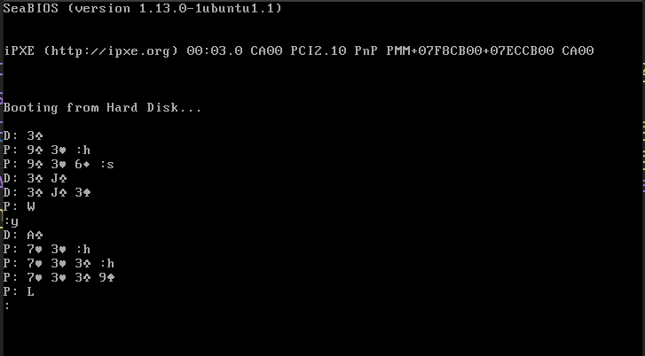

# bootjack

A bootable Blackjack written in 508 bytes.

## Limitations

This is a minimal blackjack so its single deck and missing bets, splits, etc.

I ran out of space to print scores per round, but blackjack isn't hard to calculate.

I also ran out of space for good prompts, so when its the player's turn:
`h=hit`, `q=quit`, and any other char is considered a stand.

The same type of logic exists for when the game is over. `q=quit` and any other
char is considered to be "play again".

## Running Locally

Build and run via QEMU with - `make qemu`

I also made a little C prototype in [c/](c/) that can be 
run with - `gcc c/blackjack.c -Wall -o blackjack; ./blackjack`.

## References

- [Programming Boot Sector Games - Toledo Gutierrez](https://www.amazon.com/Programming-Sector-Games-Toledo-Gutierrez/dp/0359816312)
- [x86 instructions](https://www.felixcloutier.com/x86/)
- [Linear congruential generator](https://en.wikipedia.org/wiki/Linear_congruential_generator)
- [Interrupt table for BIOS/DOS](https://stanislavs.org/helppc/int_table.html)
- [PC Interrupts: A Programmer's Reference to BIOS, DOS, and Third Party Calls - Ralf Brown](https://www.amazon.com/PC-Interrupts-Programmers-Reference-Third-dp-0201577976/dp/0201577976)
- [Code page 437](https://en.wikipedia.org/wiki/Code_page_437)
